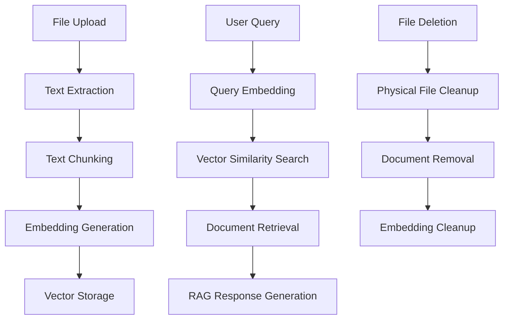

# Samsung PRISM RAG Chatbot - Vector-Based Implementation

## 🚀 Overview

This is an enhanced version of the Samsung PRISM RAG (Retrieval-Augmented Generation) chatbot that implements a comprehensive vector-based document processing and search system. The system automatically processes uploaded files, generates embeddings, and uses semantic similarity search for improved document retrieval and AI responses.

## ✨ Key Features

### 🧮 Vector-Based RAG System
- **Automatic Embedding Generation**: Text chunks are automatically converted to vector embeddings using `@xenova/transformers`
- **Semantic Search**: Uses cosine similarity for document retrieval instead of simple text matching  
- **Local Processing**: All embedding generation happens locally using the `Xenova/all-MiniLM-L6-v2` model
- **Fallback Support**: Falls back to text-based search if embedding generation fails

### 📄 Enhanced File Processing
- **Immediate Processing**: Files are processed and chunked as soon as they're uploaded
- **Multiple File Types**: PDF, DOCX, TXT, XLSX, XLS, and images (OCR)
- **Smart Chunking**: Text is chunked with overlap for better semantic coherence
- **Embedding Integration**: Each chunk gets its own vector embedding for precise retrieval

### 🗑️ Complete Lifecycle Management
- **File Upload**: Admin uploads → Processing → Chunking → Embedding → Storage
- **File Deletion**: Removes physical file, document chunks, AND associated embeddings
- **Error Handling**: Robust error handling with fallbacks at each step

### 📊 Monitoring & Analytics
- **Embedding Statistics**: Track embedding coverage and system health
- **Admin Dashboard**: Monitor file processing status and embedding generation
- **Debug Tools**: Comprehensive logging and testing scripts

## 🏗️ Architecture



## 🛠️ Technical Implementation

### Core Components

1. **Vector Store Service** (`vectorStore.ts`)
   - Handles embedding generation using Xenova/transformers
   - Manages vector similarity search with cosine similarity
   - Provides batch processing for multiple text chunks
   - Includes embedding cleanup and statistics

2. **Document Processor** (`documentProcessor.ts`)
   - Extracts text from various file formats
   - Chunks text with configurable size and overlap
   - Integrates with vector store for embedding generation
   - Handles the complete file processing pipeline

3. **RAG Service** (`ragService.ts`)
   - Implements hybrid search (vector-first with text fallback)
   - Generates contextual responses using Ollama
   - Manages document relevance scoring
   - Provides comprehensive source attribution

4. **Admin Controller** (`adminController.ts`)
   - Handles file upload with immediate processing
   - Provides embedding statistics endpoint
   - Ensures complete cleanup on file deletion
   - Includes monitoring and management features

### Database Schema

The MongoDB document model includes:
```javascript
{
  userId: ObjectId,          // Optional for system files
  fileId: ObjectId,          // Reference to file
  content: String,           // Text chunk content
  chunkIndex: Number,        // Position in original document
  embedding: [Number],       // Vector embedding (384 dimensions)
  metadata: {
    source: String,          // Source description
    fileName: String,        // Original file name
    tags: [String]          // File type and other tags
  }
}
```

## 🚦 Getting Started

### Prerequisites
- Node.js 18+ and npm
- MongoDB running locally
- Ollama with phi model (for AI responses)

### Installation
```bash
# Install dependencies (includes @xenova/transformers)
cd backend && npm install

# Build the project
npm run build
```

### Running the System
```bash
# Start MongoDB
mongod

# Start the backend (in development mode)
npm run dev

# Start the frontend
cd ../src && npm start
```

### Testing the Vector RAG System
```bash
# Run comprehensive test suite
cd "/Users/yasharthkesarwani/Downloads/project 5"
node test-vector-rag.cjs
```

## 📝 Usage Workflow

### For Administrators

1. **Upload Files**
   - Access admin dashboard at `/admin`
   - Upload documents (PDF, DOCX, TXT, XLSX, images)
   - Files are automatically processed and embeddings generated
   - Monitor processing status in file list

2. **Monitor System Health**
   - Check embedding statistics: `GET /api/admin/embeddings/stats`
   - View file processing status in admin dashboard
   - Monitor system logs for processing details

3. **File Management**
   - Delete files removes all associated data including embeddings
   - System maintains referential integrity
   - Batch operations supported

### For Users

1. **Chat with AI**
   - Ask questions through the chat interface
   - System uses vector similarity to find relevant documents
   - Responses include source attribution
   - Fallback to general responses when no relevant docs found

2. **Document Search** 
   - Direct document search via API: `POST /api/search/documents`
   - Returns ranked results with similarity scores
   - Supports semantic queries (not just keyword matching)

## 🔧 API Endpoints

### Document Search
```http
POST /api/search/documents
Authorization: Bearer <token>
Content-Type: application/json

{
  "query": "blockchain development",
  "limit": 5
}
```

### Chat with RAG
```http
POST /api/chat
Authorization: Bearer <token>
Content-Type: application/json

{
  "message": "How do I set up a Cosmos SDK project?"
}
```

### Embedding Statistics (Admin)
```http
GET /api/admin/embeddings/stats
Authorization: Bearer <admin-token>
```

Response:
```json
{
  "success": true,
  "data": {
    "totalDocuments": 150,
    "documentsWithEmbeddings": 145,
    "documentsWithoutEmbeddings": 5,
    "embeddingCoverage": 96.7,
    "embeddingCoverageFormatted": "96.7%"
  }
}
```

## 🎯 Performance Characteristics

### Embedding Generation
- **Model**: Xenova/all-MiniLM-L6-v2 (384 dimensions)
- **Speed**: ~100-500ms per chunk (depends on length)
- **Batch Processing**: Optimized for multiple chunks
- **Memory**: Model cached after first load

### Search Performance
- **Vector Search**: O(n) complexity with optimized cosine similarity
- **Fallback**: Text-based search for edge cases
- **Response Time**: Typically <100ms for search, 2-10s for RAG generation
- **Accuracy**: Significant improvement over keyword-based search

### Storage Requirements
- **Embeddings**: ~1.5KB per document chunk (384 floats)
- **Text Storage**: Original chunk text preserved
- **Metadata**: Source attribution and indexing information

## 🔍 Monitoring & Debugging

### Logging
The system provides comprehensive logging for:
- File processing pipeline
- Embedding generation progress  
- Vector search operations
- RAG response generation
- Error conditions and fallbacks

### Test Scripts
- `debug-search.cjs`: Basic document search testing
- `test-vector-rag.cjs`: Comprehensive system testing
- `test-complete-flow.cjs`: End-to-end workflow testing

### Health Checks
Monitor system health through:
- Embedding statistics endpoint
- File processing status in admin dashboard
- MongoDB document counts and embedding coverage
- Server logs for processing pipeline status

## 🚨 Troubleshooting

### Common Issues

1. **Embedding Generation Fails**
   - Check if model download completed successfully
   - Verify sufficient memory (>2GB recommended)
   - Check network connectivity for initial model download

2. **No Search Results**
   - Verify embeddings were generated for uploaded documents
   - Check embedding statistics endpoint
   - Try text-based search to verify document presence

3. **Slow Response Times**
   - Embedding model loads on first use (one-time delay)
   - Consider adjusting chunk size for very large documents
   - Monitor memory usage during batch processing

4. **Ollama Connection Issues**
   - Ensure Ollama is running: `ollama serve`
   - Verify phi model is installed: `ollama pull phi`
   - Check if port 11434 is accessible

## 🎉 Benefits of Vector-Based RAG

### Improved Search Quality
- **Semantic Understanding**: Finds conceptually related content, not just keyword matches
- **Context Awareness**: Better understanding of user intent and document context
- **Relevance Ranking**: More accurate similarity scoring

### Enhanced User Experience  
- **Better Answers**: AI responses based on more relevant document sections
- **Source Attribution**: Clear indication of information sources
- **Fallback Handling**: Graceful degradation when vector search isn't available

### Scalability & Maintenance
- **Local Processing**: No external API dependencies for embeddings
- **Efficient Storage**: Optimized vector storage and retrieval
- **Clean Lifecycle**: Automatic cleanup prevents data accumulation
- **Monitoring**: Built-in statistics and health checks

## 📚 Further Development

### Potential Enhancements
- Support for additional embedding models
- Hybrid search combining multiple similarity measures
- Document clustering and categorization
- Multi-modal embeddings for images and tables
- Real-time embedding updates for document edits

### Production Considerations
- Vector database integration (Pinecone, Weaviate, etc.)
- Distributed processing for large document collections
- Caching strategies for frequently accessed embeddings
- Load balancing for concurrent embedding generation

---

This vector-based RAG system provides a significant improvement over traditional keyword-based search, offering more intelligent and contextual document retrieval for better AI-powered responses.
